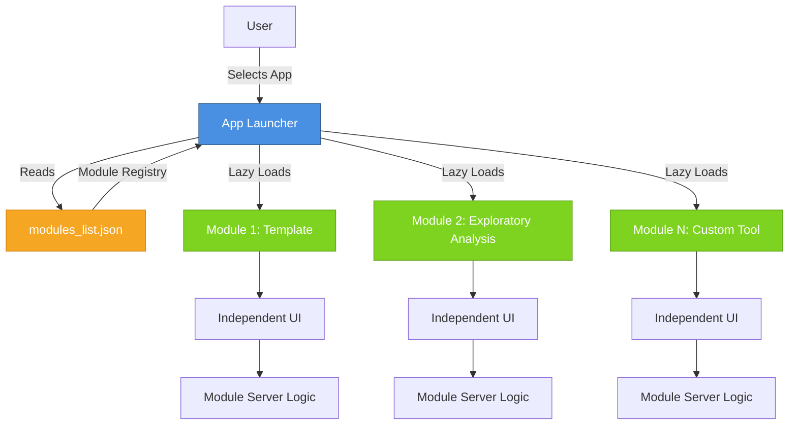

# Small Shiny Apps Platform

A self-service platform enabling non-technical lab users to develop and deploy custom data analysis tools without requiring DevOps support.

[](https://ssankhe.shinyapps.io/Small-Shiny-Apps-Platform/)
[](LICENSE)

---

## The Problem

Research labs need specialized data analysis tools—exploratory visualization, sample randomization, quality checks. Traditional approaches don't work well:

- **Full DevOps deployment** for each tool: Slow, expensive, requires infrastructure expertise
- **Standalone scripts**: Not shareable, not user-friendly for non-programmers
- **Generic tools**: Don't fit specific research workflows

## The Solution

A plug-and-play module platform where:
- One deployment serves unlimited tools
- Developers add new tools by dropping in a single R file
- Non-technical users select tools from a dropdown menu
- Each tool runs independently with zero configuration

Result: Lab researchers get the custom tools they need without waiting for DevOps support.

---

## Architecture



### Design Decisions

**Modular Architecture**: Each tool is a self-contained Shiny module with its own UI and server logic, enabling independent development and testing.

**Lazy Loading**: Modules load on-demand to minimize memory footprint and startup time. Frequently-used modules can be preloaded via configuration.

**Registry Pattern**: JSON-based module discovery allows adding/removing tools without code changes—developers simply drop in a new file and register it.

**Namespace Isolation**: Proper use of `moduleServer()` prevents ID collisions and enables unlimited concurrent module development.

**Performance Optimization**: Module caching, efficient reactive programming, and minimal re-rendering ensure smooth user experience even with complex analyses.

---

## Featured Module: Exploratory Data Analysis

A production-ready visualization suite demonstrating the platform's capabilities:

- Upload custom datasets (metadata CSV + expression matrix)
- Interactive boxplots for expression levels grouped by experimental variables
- Heatmaps of top variable features with Plotly-based tooltips
- PCA plots of sample relationships with customizable axes

Technical highlights: Comprehensive data validation (sample alignment, type checking), dynamic UI (sidebar adapts to selected tab), error handling with user-friendly messages, optimized reactive programming to minimize re-computation.

---

## Tech Stack

| Layer | Technology | Purpose |
|-------|-----------|---------|
| **Framework** | R Shiny | Reactive web applications |
| **UI** | bslib (Bootstrap 5) | Modern, responsive design |
| **Module System** | box | Explicit imports, namespace management |
| **Visualization** | ggplot2, plotly | Static and interactive plots |
| **Statistics** | R stats | PCA, variance analysis |
| **Dependency Mgmt** | renv | Reproducible environments |
| **Logging** | logger | Application monitoring |

---

## Quick Start

### Try the Live Demo

**[Launch Application](https://ssankhe.shinyapps.io/Small-Shiny-Apps-Platform/)**

### Run Locally

```bash
# Clone repository
git clone https://github.com/SumedhSankhe/Small-Shiny-Apps-Platform.git
cd Small-Shiny-Apps-Platform

# Restore dependencies
Rscript -e "renv::restore()"

# Run application
Rscript -e "shiny::runApp('app_launcher.R')"
```

### Add a New Module

```bash
# 1. Copy template
mkdir R/My_Tool && cp R/Module_Template/app.R R/My_Tool/app.R

# 2. Edit R/My_Tool/app.R (implement your UI and server functions)

# 3. Register in modules_list.json
{
  "id": "my_tool",
  "label": "My Tool",
  "source": "R/My_Tool/app.R",
  "ui": "my_tool_ui",
  "server": "my_tool_server"
}

# 4. Run the launcher and select your tool from the dropdown
```

See the [Developer Guide](user-guides/DEVELOPER_GUIDE.md) for full details.

---

## Project Structure

```
Small-Shiny-Apps-Platform/
├── app_launcher.R              # Application entry point
├── modules_list.json           # Module registry
├── R/                          # Module directory
│   ├── Module_Template/        # Reference template
│   └── Exploratory_Module/     # Example: PCA, heatmaps, boxplots
├── user-guides/
│   ├── DEVELOPER_GUIDE.md      # Adding modules, best practices
│   └── USER_GUIDE.md           # End-user documentation
├── www/                        # Static assets (CSS)
├── renv/                       # Package library
└── renv.lock                   # Locked dependencies
```

---

## Documentation

- [User Guide](user-guides/USER_GUIDE.md) - For lab researchers using the tools
- [Developer Guide](user-guides/DEVELOPER_GUIDE.md) - For developers adding new modules
- [Live Demo](https://ssankhe.shinyapps.io/Small-Shiny-Apps-Platform/) - Try the platform

---

## Impact

Reduced deployment friction for research tools from weeks (DevOps cycle) to minutes (drop in a file).

Demonstrates platform engineering, modular architecture, performance optimization, production-ready R/Shiny development, and user-centric design.

Designed for bioinformatics/lab research environments but generalizable to any domain requiring self-service analytics tools.

---

## License

This project is licensed under the MIT License - see the [LICENSE](LICENSE) file for details.

---

## Contact

**Sumedh Sankhe**
Email: [sumedh.sankhe@gmail.com](mailto:sumedh.sankhe@gmail.com)
Portfolio: [https://sumedhsankhe.github.io](https://sumedhsankhe.github.io)
