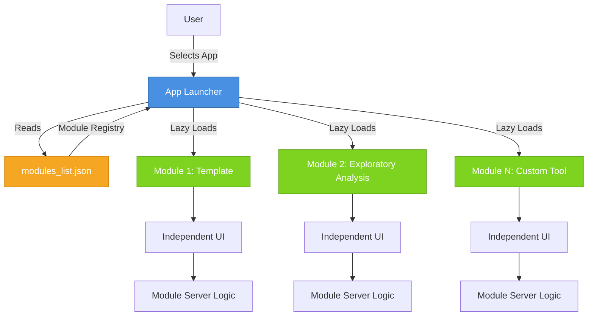

# Small Shiny Apps Platform

> **A self-service platform enabling non-technical lab users to develop, deploy, and access custom data analysis tools without requiring DevOps support.**

[](https://www.r-project.org/)
[](https://shiny.rstudio.com/)

---

## 📖 Overview

The Small Shiny Apps Platform is a **modular Shiny application framework** designed to empower lab researchers and data analysts to create and share custom data analysis tools without needing full-stack development or DevOps expertise.

### The Problem
Research labs often need specialized, one-off data analysis tools for tasks like:
- Exploratory data visualization
- Sample randomization
- Quick statistical analyses
- Data quality checks

Traditional solutions require either:
1. Full DevOps support to deploy individual apps (slow, expensive)
2. Analysts writing standalone scripts (not user-friendly, not shareable)
3. Using generic tools that don't fit specific workflows

### The Solution
This platform provides:
- **Single deployment, multiple apps**: One hosted platform serves unlimited tools
- **Plug-and-play modules**: Developers add new tools by dropping in a single R file
- **Zero deployment friction**: No infrastructure knowledge needed to add new tools
- **User-friendly interface**: Non-technical users select tools from a dropdown menu
- **Isolated execution**: Each tool runs independently for safety and simplicity

---

## 🏗️ Architecture



### Key Design Principles

1. **Modular Architecture**: Each tool is a self-contained Shiny module with its own UI and server logic
2. **Lazy Loading**: Modules load on-demand to minimize memory footprint and startup time
3. **Registry-Based Discovery**: JSON configuration allows adding/removing tools without code changes
4. **Namespace Isolation**: Proper use of Shiny's `moduleServer()` prevents ID collisions
5. **Performance Optimization**: Cached module loading and efficient reactive programming

---

## 🚀 Quick Start

### For End Users (Lab Researchers)

1. **Open RStudio** or navigate to the hosted deployment
2. **Open the file** `app_launcher.R` (if running locally)
3. Click the **Run App** button at the top of RStudio
4. In the app window, **choose a tool** from the dropdown menu
5. Use the selected tool—no coding required!

### For Developers (Adding New Tools)

1. **Copy the template**: `R/Module_Template/` → `R/Your_Tool_Name/`
2. **Edit `app.R`**: Implement your UI and server functions
3. **Register the module**: Add an entry to `modules_list.json`
4. **Test**: Run the launcher and select your tool from the dropdown

That's it! No deployment configuration, no infrastructure setup.

---

## 💡 Example Use Case: Exploratory Data Analysis

The platform includes an **Exploratory Module** (`R/Exploratory_Module/`) as a reference implementation demonstrating:

### Features
- **Upload custom datasets**: Metadata CSV + expression matrix
- **Interactive boxplots**: Expression levels by experimental groups
- **Heatmaps**: Top variable features with hierarchical clustering
- **PCA plots**: Sample relationships with customizable axes

### Technical Highlights
- **Data validation**: Comprehensive checks for sample alignment and data integrity
- **Interactive visualizations**: Plotly-based heatmaps with hover tooltips
- **Dynamic UI**: Sidebar options adapt to the selected analysis tab
- **Error handling**: Clear user feedback for malformed inputs
- **Performance**: Efficient reactive programming with minimal re-computation

**This module serves as a template** showing what lab members can build: from simple calculators to complex multi-step analyses.

---

## 🛠️ Technology Stack

| Category | Technology | Purpose |
|----------|-----------|---------|
| **Core Framework** | R Shiny | Interactive web applications |
| **UI Library** | bslib | Modern, responsive Bootstrap 5 UI |
| **Module System** | {box} | Explicit imports, namespace management |
| **Visualization** | ggplot2, plotly | Static and interactive plots |
| **Dependency Mgmt** | renv | Reproducible package environments |
| **Logging** | logger | Application monitoring and debugging |
| **Version Control** | Git | Source code management |

---

## 📁 Project Structure

```text
Small-Shiny-Apps-Platform/
├── app_launcher.R           # Main application entry point
├── modules_list.json        # Registry of available modules
├── R/                       # Module directory
│   ├── Module_Template/     # Reference template for new modules
│   │   └── app.R           # UI + server functions
│   └── Exploratory_Module/  # Example: Data visualization tool
│       └── app.R
├── www/                     # Static assets (CSS, images)
│   └── custom.css
├── renv/                    # Project-local R package library
├── renv.lock               # Locked package versions
├── .Rprofile               # R session configuration
└── README.md               # This file
```

---

## 🔧 Development Guide

### Prerequisites
- R (>= 4.0)
- RStudio (recommended)
- Git

### Setup

```bash
# Clone the repository
git clone https://github.com/YourUsername/Small-Shiny-Apps-Platform.git
cd Small-Shiny-Apps-Platform

# Restore R package dependencies
Rscript -e "renv::restore()"

# Run the app
Rscript -e "shiny::runApp('app_launcher.R')"
```

### Adding a New Module

1. **Create module folder and file**:
   ```bash
   mkdir R/My_New_Tool
   cp R/Module_Template/app.R R/My_New_Tool/app.R
   ```

2. **Edit `R/My_New_Tool/app.R`**:
   ```r
   # Rename functions to match your module
   my_tool_ui <- function(id) {
     ns <- NS(id)
     # Your UI code here
   }

   my_tool_server <- function(id) {
     moduleServer(id, function(input, output, session) {
       # Your server logic here
     })
   }
   ```

3. **Register in `modules_list.json`**:
   ```json
   {
     "id": "my_new_tool",
     "label": "My New Tool",
     "source": "R/My_New_Tool/app.R",
     "ui": "my_tool_ui",
     "server": "my_tool_server",
     "preload": false,
     "cache": false
   }
   ```

4. **Test standalone** (optional):
   - Open `R/My_New_Tool/app.R` in RStudio
   - Click "Run App" to test in isolation

5. **Launch the platform** and select your tool from the dropdown

### Best Practices

#### Module Development
- **Use `box::use()` for imports**: Explicit dependencies, no global namespace pollution
- **Keep modules self-contained**: All logic, data, and helpers in the module folder
- **Document your module**: Add purpose, inputs, outputs, and edge cases at the top
- **Validate inputs**: Use `shiny::validate()` and `shiny::need()` for user feedback
- **Use proper namespacing**: Always use `NS(id)` and wrap IDs with `ns()`

#### Data Management
- **⚠️ File size limit**: Do NOT include files totaling >50MB
- **Use sample data**: Provide small representative datasets for development
- **Document data sources**: Explain how to obtain full datasets externally
- **Prefer processed formats**: Use `.rds` or `.rda` for R objects

#### Code Quality
- **Test edge cases**: Empty inputs, mismatched samples, non-numeric data
- **Log key events**: Use `logger::log_info()` for debugging in production
- **Handle errors gracefully**: Show user-friendly messages, not raw R errors
- **Optimize performance**: Use reactive programming efficiently (avoid unnecessary re-computation)

---

## 🎯 Key Features for Recruiters/Hiring Managers

This project demonstrates:

### Software Engineering
- ✅ **Modular architecture**: Separation of concerns, plug-and-play components
- ✅ **Design patterns**: Module pattern, lazy loading, registry pattern
- ✅ **Performance optimization**: Caching, minimal re-rendering, efficient reactivity
- ✅ **Dependency management**: renv for reproducibility, box for explicit imports

### R/Shiny Expertise
- ✅ **Advanced Shiny**: Modules, namespacing, reactive programming
- ✅ **Modern UI**: bslib (Bootstrap 5), custom CSS, responsive design
- ✅ **Interactive visualizations**: ggplot2, plotly with custom interactivity
- ✅ **Production-ready**: Logging, error handling, input validation

### Data Science
- ✅ **Statistical methods**: PCA, variance analysis, hierarchical clustering
- ✅ **Data wrangling**: CSV parsing, sample alignment, data validation
- ✅ **Visualization**: Heatmaps, boxplots, PCA plots with proper scaling

### DevOps & Deployment
- ✅ **Reproducibility**: renv lock file, version-controlled dependencies
- ✅ **Configuration management**: JSON-based module registry
- ✅ **Deployment-ready**: Configured for shinyapps.io, Posit Connect, or Docker

### Product Thinking
- ✅ **User-centric design**: Serves both technical and non-technical users
- ✅ **Self-service model**: Reduces operational overhead
- ✅ **Scalable**: Add unlimited tools without infrastructure changes
- ✅ **Clear documentation**: Multiple audience levels (users, developers, recruiters)

---

## 📚 Module Registry (`modules_list.json`)

Each module is registered with:

```json
{
  "id": "unique_module_id",         // Used for internal routing
  "label": "Display Name",          // Shown in dropdown
  "source": "R/Module/app.R",       // Path to module file
  "ui": "module_ui_function",       // Name of UI function
  "server": "module_server_function", // Name of server function
  "preload": false,                 // Load at startup? (optional)
  "cache": false                    // Cache module? (optional)
}
```

---

## ⚙️ Configuration (`.Rprofile`)

The platform includes sensible defaults:
- **CRAN mirror**: Posit Public Package Manager (fast, reliable)
- **Bioconductor**: Latest release (for bioinformatics modules)
- **Upload limit**: 30MB per file
- **Error handling**: Full stack traces for debugging
- **Production settings**: Auto-reload disabled, browser launch disabled

---

## 🆘 Support & Contact

**For questions, issues, or feature requests:**

**Sumedh Sankhe**
Email: [sumedh.sankhe@gmail.com](mailto:sumedh.sankhe@gmail.com)

---

## 📝 FAQ

### For End Users

**Q: The app shows an error or won't start. What should I do?**
A: Close RStudio completely and restart. If the problem persists, contact support.

**Q: Can I use two apps at the same time or share data between them?**
A: No, each app is isolated for safety and simplicity. If you need this functionality, contact support to discuss a custom solution.

**Q: I have an idea for a new tool. How do I request it?**
A: Email your idea to support with a description of what you need.

### For Developers

**Q: How do I add R packages to the platform?**
A: Use `renv::install("packageName", lock = TRUE)` to install and lock the version.

**Q: Can modules share code or utilities?**
A: Yes, create a shared `R/utils/` folder and source helper functions, or use `box::use()` to import from other modules.

**Q: How do I deploy this platform?**
A: The app is configured for:
- **shinyapps.io**: Use `rsconnect::deployApp()`
- **Posit Connect**: Follow your organization's deployment process
- **Docker**: Create a Dockerfile based on `rocker/shiny` images

**Q: What if my module needs large datasets?**
A: Store data externally (cloud storage, database) and document how to configure access. Use small sample data for development.

---

## 📜 License

[Add your license here, e.g., MIT, GPL-3, etc.]

---

## 🙏 Acknowledgments

Built with:
- [Shiny](https://shiny.rstudio.com/) by Posit
- [bslib](https://rstudio.github.io/bslib/) for modern UI components
- [box](https://klmr.me/box/) for modular R code
- [renv](https://rstudio.github.io/renv/) for dependency management

---

## 📊 Project Status

**Current Version**: 1.0.0
**Status**: Active development
**Modules**: 2 (Template + Exploratory Analysis example)

**Roadmap**:
- [ ] Add more example modules (sample randomization, QC plots)
- [ ] Implement user authentication (optional)
- [ ] Add module versioning
- [ ] Create automated testing framework
- [ ] Add CI/CD pipeline

---

## 🔗 Related Resources

- [Shiny Modules Documentation](https://shiny.rstudio.com/articles/modules.html)
- [bslib Documentation](https://rstudio.github.io/bslib/)
- [box Package Guide](https://klmr.me/box/)
- [renv Documentation](https://rstudio.github.io/renv/)
